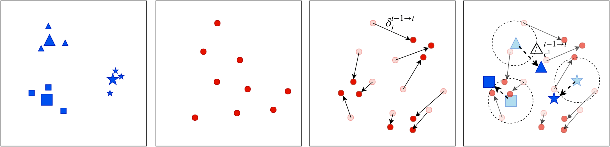

# SDC-IL
Title: Semantic Drift Compensation for Class-Incremental Learning.

The paper will be published at the conference of 2020 Computer Vision and Pattern Recognition (CVPR20). An [pre-print](https://arxiv.org/pdf/2004.00440.pdf) version is available.

## Authors
Lu Yu, Bartłomiej Twardowski, Xialei Liu, Luis Herranz, Kai Wang, Yongmei Cheng, Shangling Jui, Joost van de Weijer

## Requirments
All training and test are done in [Pytorch](https://pytorch.org/) framework.

Pytorch vesion: 0.3.0.post4

Python version: 2.7

Code with higher pytorch version will come soon...

## Illustration


## Datasets
We evaluate our system in several datasets, including ```CUB-200-2011, Flowers-102, Caltech-101, CIFAR100, ImageNet-Subset(the first 100 classes of full ImageNet)```.
Please download [CUB-200-2011](http://www.vision.caltech.edu/visipedia/CUB-200-2011.html) , [Flowers-102](https://www.robots.ox.ac.uk/~vgg/data/flowers/102/), [Caltech-101](http://www.vision.caltech.edu/Image_Datasets/Caltech101/), [CIFAR100](https://www.cs.toronto.edu/~kriz/cifar.html) and [ImagNet-Subset](http://www.image-net.org).

## Losses
The loss functions in the code refer to [source repository](https://github.com/bnu-wangxun/Deep_Metric).
